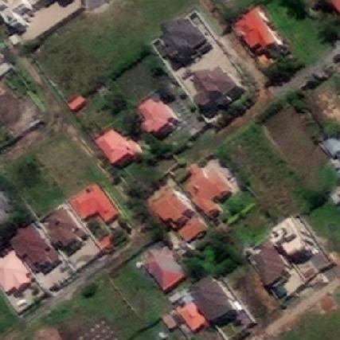

## rslearn.data_sources.local_files.LocalFiles

This data source supports ingesting data from local raster or vector files. It is
configured by a source directory that should be a flat structure with the raster or
vector files. Raster files must be readable by rasterio. Vector files must be readable
by fiona.

Each source file is treated as a separate item, so for raster files, each file must
contain the full range of bands, and different files should cover different locations.

### Configuration

```jsonc
{
  "class_path": "rslearn.data_sources.local_files.LocalFiles",
  "init_args": {
    // Required source directory containing the flat structure of raster or vector files.
    // It is relative to the dataset root, so include a protocol if it is outside.
    // Example: "file:///path/to/files/".
    "src_dir": null
  }
}
```

### Available Bands

For raster data, the bands will be named "B1", "B2", and so on depending on the number
of bands in the source files.

The time range of all items is null (infinite).

### Example: Raster Data

Suppose you have a folder on the local filesystem with several image scenes, where each
GeoTIFF file has all of the bands for one scene.

For example, we can download Maxar open data:

```
export RASTER_DATA_PATH=/path/to/raster_data
mkdir $RASTER_DATA_PATH
wget https://maxar-opendata.s3.amazonaws.com/events/Kenya-Flooding-May24/ard/37/211111023303/2024-05-11/105001003B003900-visual.tif -O $RASTER_DATA_PATH/211111023303.tif
wget https://maxar-opendata.s3.amazonaws.com/events/Kenya-Flooding-May24/ard/37/211111032230/2024-05-11/105001003B003900-visual.tif -O $RASTER_DATA_PATH/211111032230.tif
wget https://maxar-opendata.s3.amazonaws.com/events/Kenya-Flooding-May24/ard/37/211111032221/2024-05-11/105001003B003900-visual.tif -O $RASTER_DATA_PATH/211111032221.tif
```

Then we can configure our dataset as follows:

```json
{
  "layers": {
    "maxar": {
      "band_sets": [{
          "bands": ["B1", "B2", "B3"],
          "dtype": "uint8"
      }],
      "data_source": {
        "class_path": "rslearn.data_sources.local_files.LocalFiles",
        "init_args": {
          "src_dir": "${RASTER_DATA_PATH}"
        }
      },
      "type": "raster"
    }
  }
}
```

Save this to a dataset folder like `/path/to/dataset/config.json`. Then create a window
and run prepare/ingest/materialize.

```
export DATASET_PATH=/path/to/dataset
rslearn dataset add_windows --root $DATASET_PATH --group default --name my_window --box=36.934,-1.363,36.934,-1.363 --src_crs EPSG:4326 --window_size 512 --utm --resolution 0.3 --start 2024-05-01T00:00:00Z --end 2024-06-01T00:00:00Z
rslearn dataset prepare --root $DATASET_PATH
rslearn dataset ingest --root $DATASET_PATH
rslearn dataset materialize --root $DATASET_PATH
```

Visualize the materialized image in qgis:

```
qgis $DATASET_PATH/windows/default/my_window/layers/maxar/B1_B2_B3/geotiff.tif
```



Then, if we add additional layers to the rslearn dataset, we can materialize aligned
raster and vector data from other modalities, e.g. Sentinel-2 satellite images.
