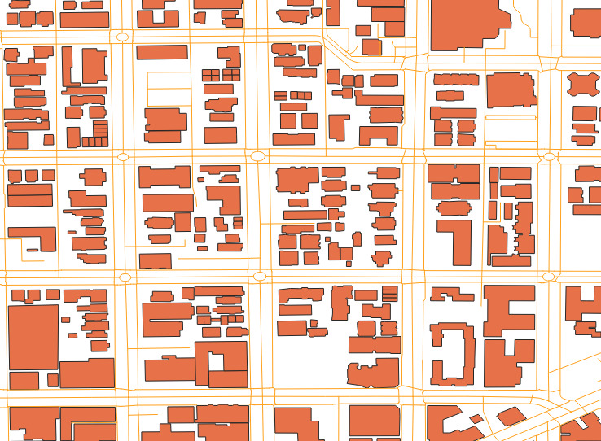
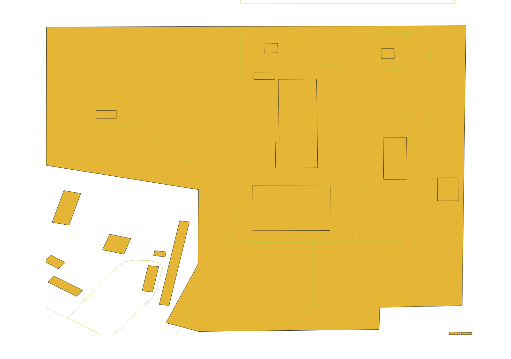

## rslearn.data_sources.openstreetmap.OpenStreetMap

This data source is for ingesting vector OpenStreetMap features from a PBF file.

An existing local PBF file can be used, or if the provided path doesn't exist, then the
global OSM PBF will be downloaded.

This data source uses a single item. During ingestion, only vector data within the
bounds of the windows in the dataset are ingested. If more windows are added, data in
the TileStore will need to be deleted and re-computed.

### Configuration

```jsonc
{
  "class_path": "rslearn.data_sources.openstreetmap.OpenStreetMap",
  "init_args": {
    // Required list of PBF filenames to read from.
    // If a single filename is provided and it doesn't exist, the latest planet PBF will
    // be downloaded there.
    "pbf_fnames": ["planet-latest.osm.pbf"],
    // Required file to cache the bounds of the different PBF files.
    "bounds_fname": "bounds.json",
    // Required map of categories to extract from the OSM data.
    // Each category specifies a set of restrictions that extract only a certain type of
    // OSM feature, and convert it to a GeoJSON feature.
    "categories": {
      // The key will be added as a "category" property in the resulting GeoJSON
      // features.
      "aerialway_pylon": {
        // Optional limit on the types of features to match. If set, valid list values
        // are "node", "way", "relation".
        // Example: ["node"] to only match nodes.
        "feature_types": null,
        // Optional tag conditions. For each entry (tag_name, values list), only match
        // OSM features with that tag, and if values list is not empty, only match if the
        // tag value matches one element of the values list.
        // The default is null. The example below will only match OSM features with the
        // "aerialway" tag set to "pylon".
        "tag_conditions": {
          "aerialway": ["pylon"]
        },
        // Optional tag properties. This is used to save properties of the OSM feature in
        // the resulting GeoJSON feature. It is a list of [tag name, prop name]. If tag
        // tag name exists on the OSM feature, then it will be populated into the prop
        // name property on the GeoJSON feature.
        // Example: [["aerialway:heating", "aerialway:heating"]]
        "tag_properties": null,
        // Optionally convert the OpenStreetMap feature to the specified geometry type
        // (one of "Point", "LineString", "Polygon"). Otherwise, matching nodes result in
        // Points, matching ways result in LineStrings, and matching relations result in
        // Polygons. Note that nodes cannot be converted to LineString/Polygon.
        "to_geometry": "Point"
      }
    }
  }
}
```

### Example

Here is an example dataset configuration to obtain road, building, and power plant
features.

```json
{
  "layers": {
    "openstreetmap": {
      "data_source": {
        "class_path": "rslearn.data_sources.openstreetmap.OpenStreetMap",
        "init_args": {
          "bounds_fname": "source_data/openstreetmap/pbf_bounds.json",
          "pbf_fnames": [
            "source_data/openstreetmap/washington-latest.osm.pbf"
          ],
          "categories": {
            "road": {
              "feature_types": [
                "WAY"
              ],
              "tag_conditions": {
                "highway": []
              },
              "tag_properties": {
                "highway": "highway"
              },
              "to_geometry": "LineString"
            },
            "building": {
              "feature_types": [
                "WAY",
                "RELATION"
              ],
              "tag_conditions": {
                "building": []
              },
              "tag_properties": {
                "building": "building"
              },
              "to_geometry": "Polygon"
            },
            "power_plant": {
              "feature_types": [
                "WAY",
                "RELATION"
              ],
              "tag_conditions": {
                "power": [
                  "plant"
                ]
              },
              "tag_properties": {
                "plant:source": "plant:source"
              },
              "to_geometry": "Polygon"
            }
          }
        }
      },
      "vector_format": {
        "class_path": "rslearn.utils.vector_format.GeojsonVectorFormat",
        "init_args": {
          "coordinate_mode": "WGS84"
        }
      },
      "type": "vector"
    }
  }
}
```

Roads are features with the ["highway" tag](https://wiki.openstreetmap.org/wiki/Key:highway);
we retain the tag in the output feature (using `tag_properties`) so we can see the road type. Similarly, buildings are way or relation features (typically enclosed) and the
["building" tag](https://wiki.openstreetmap.org/wiki/Key:building) indicates the type.
Power plants have the ["power" tag set to "plant"](https://wiki.openstreetmap.org/wiki/Tag:power=plant) and often have a "plant:source" tag indicating the energy source.

Save this to a dataset folder like `/path/to/dataset/config.json`.
Then download `washington-latest.osm.pbf` from Geofabrik:

```
export DATASET_PATH=/path/to/dataset
mkdir -p $DATASET_PATH/source_data/openstreetmap
wget https://download.geofabrik.de/north-america/us/washington-latest.osm.pbf -O $DATASET_PATH/source_data/openstreetmap/washington-latest.osm.pbf
```

Then create two windows and materialize the data. We create one window where we expect
several roads and buildings, and one where we expect a power plant.

```
rslearn dataset add_windows --root $DATASET_PATH --group default --name roads_and_buildings --box=-122.314,47.617,-122.314,47.617 --src_crs EPSG:4326 --window_size 512 --utm --resolution 1
rslearn dataset add_windows --root $DATASET_PATH --group default --name power_plant --box=-122.915,46.622,-122.915,46.622 --src_crs EPSG:4326 --window_size 512 --utm --resolution 1
rslearn dataset prepare --root $DATASET_PATH
rslearn dataset ingest --root $DATASET_PATH
rslearn dataset materialize --root $DATASET_PATH
```

You can then visualize the data in qgis:

```
qgis $DATASET_PATH/windows/default/*/layers/openstreetmap/data.geojson
```

The roads_and_buildings data looks like this:



And the data for the power_plant window looks like this:


