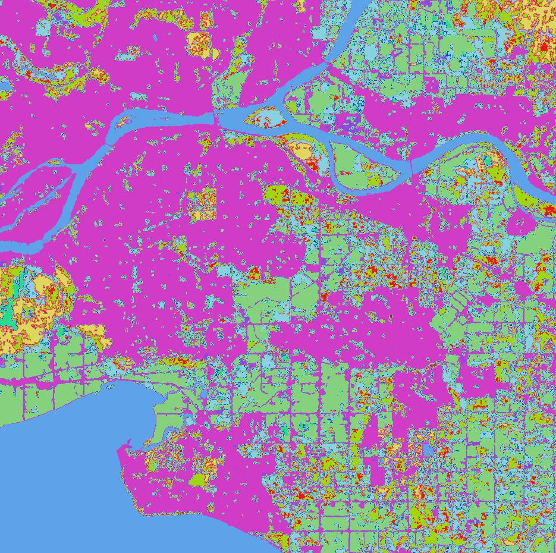

## rslearn.data_sources.planetary_computer.PlanetaryComputer

This data source is a base class for raster data from Microsoft Planetary Computer. See
their [Data Catalog](https://planetarycomputer.microsoft.com/catalog).

This data source supports direct materialization: if the "ingest" flag is set false,
then ingestion will be skipped and windows will be directly populated from windowed
reads of the underlying cloud-optimized GeoTIFFs on Azure Blob Storage.

Convenience subclasses exist for some modalities available in the catalog like
Sentinel-2 L2A imagery and Sentinel-1 RTC imagery, see [DataSources](../DataSources.md).

### Configuration

```jsonc
{
  "class_path": "rslearn.data_sources.planetary_computer.PlanetaryComputer",
  "init_args": {
    // Required collection name, e.g. "landsat-c2-l2" or "modis-17A2HGF-061".
    "collection_name": null,
    // Required map from asset name to list of bands in the asset to download.
    // You may need to perform a STAC search to see what the asset names are.
    // Example: {"B8A": ["B8A"], "visual": ["R", "G", "B"]}
    "asset_bands": null,
    // Include this query argument for STAC searches.
    // Example: {"sar:instrument_mode": {"eq": "IW"}}
    "query": null,
    // Sort by this property in the STAC items.
    // Example: "eo:cloud_cover"
    "sort_by": null,
    // Whether to sort ascending or descending (default ascending).
    "sort_ascending": true,
    // Timeout for requests.
    "timeout_seconds": 10
  }
}
```

### Available Bands

The band names correspond to the `asset_bands` argument.

### Example

Here is an example dataset configuration for Land Cover of Canada data on Planetary
Computer (https://planetarycomputer.microsoft.com/dataset/nrcan-landcover).

```json
{
  "layers": {
    "land_cover_of_canada": {
      "band_sets": [{
          "bands": ["landcover"],
          "dtype": "uint8"
      }],
      "data_source": {
        "class_path": "rslearn.data_sources.planetary_computer.PlanetaryComputer",
        "init_args": {
          "collection_name": "nrcan-landcover",
          "asset_bands": {"landcover": ["landcover"]}
        },
        "ingest": false
      },
      "type": "raster"
    }
  }
}
```

Save this to a dataset folder like `/path/to/dataset/config.json`. Then we can create a
sample window and run prepare and materialize.

```
export DATASET_PATH=/path/to/dataset
# This will create one 1024x1024 window at 30 m/pixel, which matches the data
# resolution. We look at a location in Surrey. The STAC items have time range 2015-2019
# (the data is for 2015) so we set the time range here accordingly.
rslearn dataset add_windows --root $DATASET_PATH --group default --name surrey --box=-122.765,49.142,-122.765,49.142 --src_crs EPSG:4326 --window_size 1024 --utm --resolution 30 --start 2019-01-01T00:00:00Z --end 2020-01-01T00:00:00Z
rslearn dataset prepare --root $DATASET_PATH
rslearn dataset materialize --root $DATASET_PATH
```

You can then visualize the image in qgis:

```
qgis $DATASET_PATH/windows/default/surrey/layers/land_cover_of_canada/landcover/geotiff.tif
```


