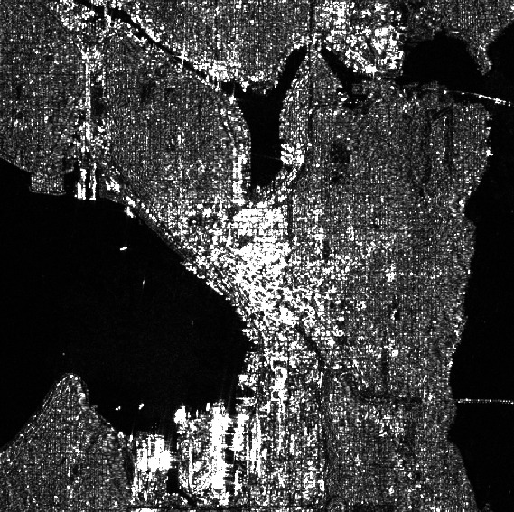

## rslearn.data_sources.planetary_computer.Sentinel1

Sentinel-1 radiometrically-terrain-corrected data on Microsoft Planetary Computer
(https://planetarycomputer.microsoft.com/dataset/sentinel-1-rtc).

### Configuration

```jsonc
{
  "class_path": "rslearn.data_sources.planetary_computer.Sentinel1",
  "init_args": {
    // See rslearn.data_sources.planetary_computer.PlanetaryComputer.
    "query": null,
    "sort_by": null,
    "sort_ascending": true,
    "timeout_seconds": 10
  }
}
```

### Available Bands

The band names are "hh", "hv", "vv", and "vh" depending on the scene. Pixel values are
float32.

### Example

Here is an example data source configuration to obtain vv/vh images.

```json
{
  "layers": {
    "sentinel1": {
      "band_sets": [
        {
          "bands": [
            "vv",
            "vh"
          ],
          "dtype": "float32"
        }
      ],
      "data_source": {
        "cache_dir": "cache/planetary_computer",
        "ingest": false,
        "name": "rslearn.data_sources.planetary_computer.Sentinel1",
        "query": {
          "sar:instrument_mode": {
            "eq": "IW"
          },
          "sar:polarizations": {
            "eq": [
              "VV",
              "VH"
            ]
          }
        }
      },
      "type": "raster"
    }
  }
}
```

Save this to a dataset folder like `/path/to/dataset/config.json`. Then we can create a
sample window, and then run prepare and materialize (skipping ingest since we disabled
it above in favor of directly materializing from the Planetary Computer COGs):

```
export DATASET_PATH=/path/to/dataset
# This will create one 1024x1024 window at 10 m/pixel, which matches the Sentinel-1
# resolution.
rslearn dataset add_windows --root $DATASET_PATH --group default --name seattle --box=-122.337,47.616,-122.337,47.616 --src_crs EPSG:4326 --window_size 1024 --utm --resolution 10 --start 2025-07-01T00:00:00Z --end 2025-08-01T00:00:00Z
rslearn dataset prepare --root $DATASET_PATH
rslearn dataset materialize --root $DATASET_PATH
```

You can then visualize the image in qgis:

```
qgis $DATASET_PATH/windows/default/seattle/layers/sentinel1/vv_vh/geotiff.tif
```

Here is a screenshot of the vv band in qgis with min=0 max=1:


