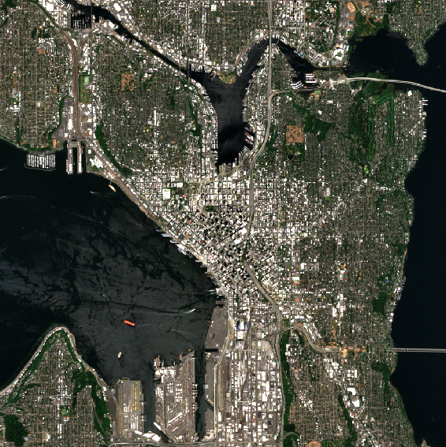

## rslearn.data_sources.planetary_computer.Sentinel2

Sentinel-2 L2A data on Microsoft Planetary Computer. This data source obtains
Sentinel-2 satellite images from https://planetarycomputer.microsoft.com/dataset/sentinel-2-l2a.

### Configuration

```jsonc
{
  "class_path": "rslearn.data_sources.planetary_computer.Sentinel2",
  "init_args": {
    // Flag (default false) to harmonize pixel values across different processing
    // baselines (recommended), see
    // https://developers.google.com/earth-engine/datasets/catalog/COPERNICUS_S2_SR_HARMONIZED
    "harmonize": false,
    // See rslearn.data_sources.planetary_computer.PlanetaryComputer.
    "query": null,
    "sort_by": null,
    "sort_ascending": true,
    "timeout_seconds": 10
  }
}
```

This data source supports direct materialization (`"ingest": false`).

### Available Bands

These uint16 bands are available:

- B01
- B02
- B03
- B04
- B05
- B06
- B07
- B08
- B09
- B11
- B12
- B8A

Note that B10 is not present in L2A.

The following uint8 bands are also available from the TCI (visual) product. These are
processed from B04, B03, and B02:

- R
- G
- B


### Example

Here is an example data source configuration to obtain 8-bit RGB imagery. We set
`sort_by` to get the least cloudy scene based on the overall scene metadata.

```json
{
  "layers": {
    "sentinel2": {
      "band_sets": [{
          "bands": ["R", "G", "B"],
          "dtype": "uint8"
      }],
      "data_source": {
        "class_path": "rslearn.data_sources.planetary_computer.Sentinel2",
        "init_args": {
          "cache_dir": "cache/planetary_computer",
          "harmonize": true,
          "sort_by": "eo:cloud_cover"
        },
        "ingest": false,
        "query_config": {
          "max_matches": 1,
          "space_mode": "MOSAIC"
        }
      },
      "type": "raster"
    }
  }
}
```

Save this to a dataset folder like `/path/to/dataset/config.json`. Then we can create a
sample window, and then run prepare and materialize (skipping ingest since we disabled
it above in favor of directly materializing from the Planetary Computer COGs):

```
export DATASET_PATH=/path/to/dataset
# This will create one 1024x1024 window at 10 m/pixel, which matches the Sentinel-2
# resolution.
rslearn dataset add_windows --root $DATASET_PATH --group default --name seattle --box=-122.337,47.616,-122.337,47.616 --src_crs EPSG:4326 --window_size 1024 --utm --resolution 10 --start 2025-07-01T00:00:00Z --end 2025-08-01T00:00:00Z
rslearn dataset prepare --root $DATASET_PATH
rslearn dataset materialize --root $DATASET_PATH
```

You can then visualize the image in qgis:

```
qgis $DATASET_PATH/windows/default/seattle/layers/sentinel2/R_G_B/geotiff.tif
```



### Harmonization

Scenes at or after processing baseline 04.00 have pixel values that are 1000 higher so
that there is more contrast between dark pixels. Harmonization undoes this by
subtracting 1000 from the pixel values in these scenes. Note that, while we enabled
harmonization above, the TCI (8-bit visual) image is unaffected by harmonization.

We recommend enabling harmonization whenever you are using any scenes captured before
2022-01-25. If you are only using newer scenes, and want to leverage the added
contrast, then include a filter on the processing baseline to ensure no older scenes
got included, e.g.:

```json
{
  "class_path": "rslearn.data_sources.planetary_computer.Sentinel2",
  "init_args": {
    "cache_dir": "cache/planetary_computer",
    "harmonize": false,
    "query": {
      "s2:processing_baseline": {"gte": "04.00"}
    }
  }
}
```
