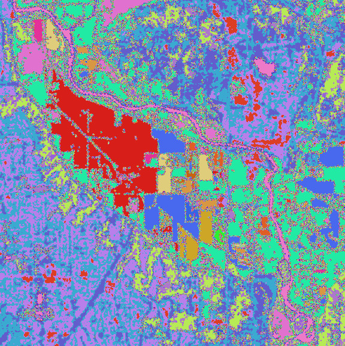

## rslearn.data_sources.usda_cdl.CDL

This data source is for the USDA Cropland Data Layer.

The GeoTIFF data will be downloaded from the USDA website. See
https://www.nass.usda.gov/Research_and_Science/Cropland/SARS1a.php for details about
the data.

There is one GeoTIFF item per year from 2008. Each GeoTIFF spans the entire continental
US, and has a single band.

### Configuration

```jsonc
{
  "class_path": "rslearn.data_sources.usda_cdl.CDL",
  "init_args": {
    // Optional timeout for HTTP requests.
    "timeout_seconds": 10
  }
}
```

### Available Bands

The data source yields one band, and the name will match whatever is configured in the
band set. It should be uint8.

At https://www.nass.usda.gov/Research_and_Science/Cropland/metadata/metadata_CDL24_FGDC-STD-001-1998.htm
it shows the meaning of the band values (search for "Categorization Code").

### Example

Here is an example data source configuration:

```json
{
  "layers": {
    "cdl": {
      "band_sets": [{
          "bands": ["cdl"],
          "dtype": "uint8"
      }],
      "data_source": {
        "class_path": "rslearn.data_sources.usda_cdl.CDL"
      },
      "type": "raster"
    }
  }
}
```

Save this to a dataset folder like `/path/to/dataset/config.json`. Then we can create a
sample window, and then run prepare/ingest/materialize.

```
export DATASET_PATH=/path/to/dataset
# This will create one 1024x1024 window at 10 m/pixel, which matches the Sentinel-2
# resolution. We pick an area with several crop fields.
rslearn dataset add_windows --root $DATASET_PATH --group default --name my_window --box=-122.131,47.905,-122.131,47.905 --src_crs EPSG:4326 --window_size 1024 --utm --resolution 10
rslearn dataset prepare --root $DATASET_PATH
rslearn dataset ingest --root $DATASET_PATH
rslearn dataset materialize --root $DATASET_PATH
```

You can then visualize the image in qgis:

```
qgis $DATASET_PATH/windows/default/my_window/layers/cdl/cdl/geotiff.tif
```


