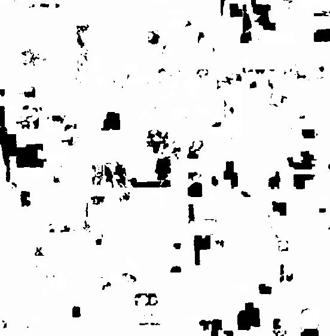

## rslearn.data_sources.worldcereal.WorldCereal

This data source is for the ESA WorldCereal 2021 agricultural land cover map. For
details about the land cover map, see https://esa-worldcereal.org/en.

This data source will download and extract all of the WorldCereal GeoTIFFs to a local
directory. Since different regions are covered with different bands, the data source is
designed to only be configured with one band per layer; to materialize multiple bands,
repeat the data source across multiple layers (with different bands).

### Configuration

```jsonc
{
  "class_path": "rslearn.data_sources.worldcereal.WorldCereal",
  "init_args": {
    // Required local path to extract the WorldCereal GeoTIFF files. For high performance,
    // this should be a local directory; if the dataset is remote, prefix with a protocol
    // ("file://") to use a local directory.
    "worldcereal_dir": "cache/worldcereal"
  }
}
```

### Available Bands

Specify one per layer, with a single-band band set:
- tc-annual_temporarycrops_confidence
- tc-annual_temporarycrops_classification
- tc-maize-main_irrigation_confidence
- tc-maize-main_irrigation_classification
- tc-maize-main_maize_confidence
- tc-maize-main_maize_classification
- tc-maize-second_irrigation_confidence
- tc-maize-second_irrigation_classification
- tc-maize-second_maize_confidence
- tc-maize-second_maize_classification
- tc-springcereals_springcereals_confidence
- tc-springcereals_springcereals_classification
- tc-wintercereals_irrigation_confidence
- tc-wintercereals_irrigation_classification
- tc-wintercereals_wintercereals_confidence
- tc-wintercereals_wintercereals_classification


### Example

Here is an example data source configuration to obtain the maize-main and wintercereals
classification. We configure the tile store to use the given raster files directly. We
use SINGLE_COMPOSITE due to an issue with the data source where most bands consist of
several sparse GeoTIFF files spanning the entire world, and so during prepare it won't
be able to determine which files match with the window; with SINGLE_COMPOSITE, all of
those files will be combined into one item group, and during materialization we will
use the first one that is not NODATA.

```json
{
  "layers": {
    "maize": {
      "band_sets": [
        {
          "bands": [
            "tc-maize-main-maize-classification"
          ],
          "dtype": "float32"
        }
      ],
      "data_source": {
        "class_path": "rslearn.data_sources.worldcereal.WorldCereal",
        "init_args": {
          "worldcereal_dir": "source_data/worldcereal/"
        },
        "query_config": {
          "space_mode": "SINGLE_COMPOSITE"
        }
      },
      "resampling_method": "nearest",
      "type": "raster"
    },
    "wintercereals": {
      "band_sets": [
        {
          "bands": [
            "tc-wintercereals-wintercereals-classification"
          ],
          "dtype": "float32"
        }
      ],
      "data_source": {
        "class_path": "rslearn.data_sources.worldcereal.WorldCereal",
        "init_args": {
          "worldcereal_dir": "source_data/worldcereal/"
        },
        "query_config": {
          "space_mode": "SINGLE_COMPOSITE"
        }
      },
      "resampling_method": "nearest",
      "type": "raster"
    }
  },
  "tile_store": {
    "class_path": "rslearn.tile_stores.default.DefaultTileStore",
    "init_args": {
      "convert_rasters_to_cogs": false
    }
  }
}
```

Save this to a dataset folder like `/path/to/dataset/config.json`. Then we can create a
sample window, and then run prepare, ingest, and materialize.

```
export DATASET_PATH=/path/to/dataset
# This will create one 1024x1024 window at 10 m/pixel in Ohio.
# WorldCereal data is treated as static-in-time so the time range of the window will be
# ignored.
rslearn dataset add_windows --root $DATASET_PATH --group default --name ohio --box=-80.626,41.758,-80.626,41.758 --src_crs EPSG:4326 --window_size 1024 --utm --resolution 10 --start 2025-01-01T00:00:00Z --end 2026-01-01T00:00:00Z
rslearn dataset prepare --root $DATASET_PATH
rslearn dataset ingest --root $DATASET_PATH
rslearn dataset materialize --root $DATASET_PATH
```

You can then visualize the image in qgis:

```
qgis $DATASET_PATH/windows/default/ohio/layers/maize/tc-maize-main-maize-classification/geotiff.tif
```


