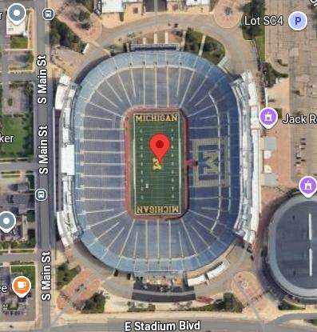
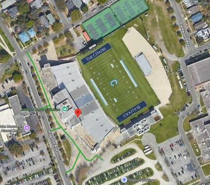
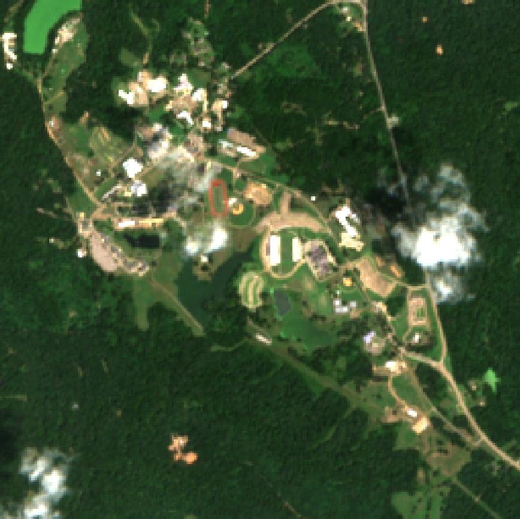
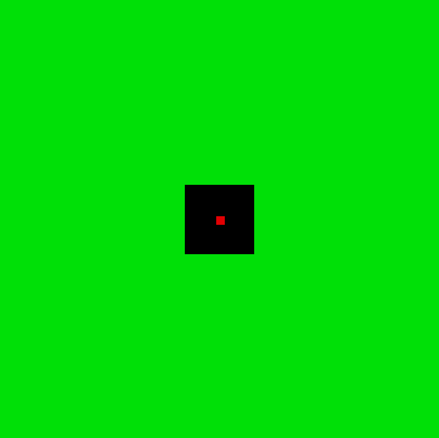
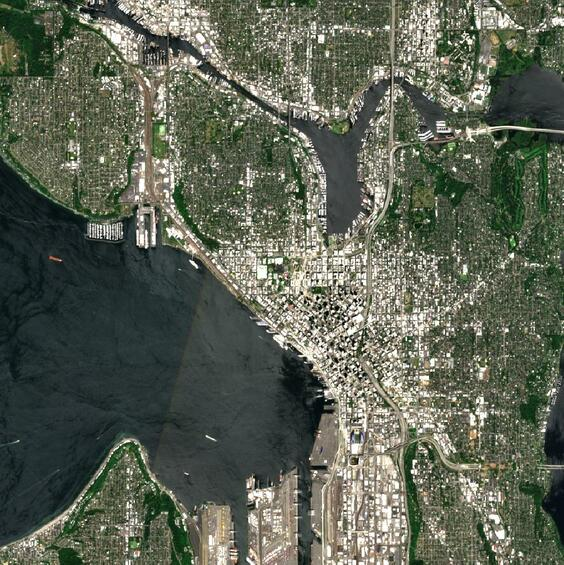
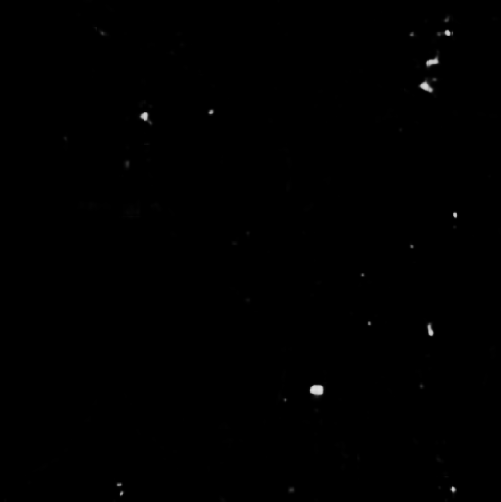

## Fine-tuning OlmoEarth and Other Models to Find Stadiums

This example walks through fine-tuning OlmoEarth and other models to find stadiums.

Compared to other examples like [FinetuneOlmoEarth](./FinetuneOlmoEarth.md), there are
two unique aspects to this example:

- We will fine-tune with multiple remote sensing foundation models, and compare their
  performance.
- We will start with training data consisting of the locations of 251 stadiums in the
  US, and show how to use it to train a segmentation model. There are two key challenges
  associated with this data: (1) instead of dense segmentation masks, we only have
  sparse point labels; and (2) we only have positive labels.

## Training Data

We will start with a CSV of stadiums in `docs/examples/FindStadiums/stadiums.csv`, which
is originally from [gboeing/data-visualization](https://raw.githubusercontent.com/gboeing/data-visualization/refs/heads/main/ncaa-football-stadiums/data/stadiums-geocoded.csv).

It consists of stadium points like this:

| stadium | city | state | team | conference | capacity | built | expanded | div | latitude | longitude |
| --- | --- | --- | --- | --- | --- | --- | --- | --- | --- | --- |
| Michigan Stadium | Ann Arbor | MI | Michigan | Big Ten | 107601 | 1927 | 2015 | fbs | 42.2659 | -83.7487 |
| Johnson Hagood Stadium | Charleston | South Carolina | The Citadel Bulldogs | Southern | 21000 | 1948 | 2008 | fcs | 32.7933 | -79.9564 |
| Beaver Stadium | University Park | PA | Penn State | Big Ten | 106572 | 1960 | 2001 | fbs | 40.8122 | -77.8562 |

One issue with the data is that, while some of these coordinates are at the center of
the stadium, others are off to the side:

<p float="left">


</p>

## Data Strategy

We want to train a model to classify each pixel as "stadium" or "background".
As mentioned above, there are two key challenges with the data:

1. Instead of dense segmentation masks, we only have sparse point labels.
2. We only have positive labels.

A typical approach for addressing the first challenge is to mask the loss everywhere
except at the pixel corresponding to the label, and input random crops where the label
appears at a random position within the crop. This way, the segmentation model is
trained to output a reasonable prediction at each output pixel. We could also train a
classification model, but this does not scale well if we want to perform inference to
compute per-pixel predictions over large areas (needs one forward pass per pixel).

To achieve this with 64x64 input crops in rslearn, we would create a 128x128 window
centered at the labeled point, and programmatically add a 128x128 label GeoTIFF where
all pixels are NODATA except the pixel in the center. Then, in the model configuration,
we can set `crop_size: 64`; this way, the random cropping will choose crops that have
the labeled point at random pixel positions.

To also address the second challenge, we adapt this approach. Specifically, we will use
the area around the stadium as negatives, and just assume that there are no other
stadiums in its vicinity.

To handle stadiums spanning many pixels and the coordinates not being exact, we will
make two more modifications:

- Instead of just marking the labeled pixel as "stadium", we mark the 5x5 neighborhood
  around the point.
- Then, around that, we put a 40x40 NODATA buffer. This masks out the loss for pixels
  close to the stadium that we are not sure about due to the coordinate imprecision.
- Finally, we assume the rest of the area is "background".

Here is an example label and corresponding Sentinel-2 image. Red is "stadium", green is
"background", and black is nodata (will have masked loss).

<p float="left">


</p>

## Create Windows

Create a new directory to contain the rslearn dataset:

```
mkdir ./dataset
export DATASET_PATH=./dataset
```

Write the dataset config below to `./dataset/config.json`. Besides specifying layers
for the labels and prediction outputs, it also includes a Sentinel-2 layer that rslearn
should populate with up to three Sentinel-2 images per window, with one per thirty-day
period of each window's time range.

```json
{
  "layers": {
    "label": {
      "band_sets": [
        {
          "bands": ["label"],
          "dtype": "uint8",
          "nodata_value": 0
        }
      ],
      "type": "raster"
    },
    "output": {
      "band_sets": [
        {
          "bands": ["prob"],
          "dtype": "float32"
        }
      ],
      "type": "raster"
    },
    "sentinel2": {
      "band_sets": [
        {
          "bands": ["B01", "B02", "B03", "B04", "B05", "B06", "B07", "B08", "B8A", "B09", "B11", "B12"],
          "dtype": "uint16"
        }
      ],
      "data_source": {
        "class_path": "rslearn.data_sources.planetary_computer.Sentinel2",
        "ingest": false,
        "init_args": {
          "cache_dir": "cache/planetary_computer",
          "harmonize": true,
          "query": {"eo:cloud_cover": {"lt": 50}},
          "sort_by": "eo:cloud_cover"
        },
        "query_config": {
          "max_matches": 3,
          "period_duration": "30d"
        }
      },
      "type": "raster"
    }
  }
}
```

The script below implements the data strategy discussed above. We skip Washington since
we will test the model on a portion of Seattle, WA later. The windows all share the same
90-day time range, from 1 June 2025 to 30 August 2025.

```python
import csv
import hashlib
import os
from datetime import UTC, datetime

import numpy as np
import shapely
import tqdm
from upath import UPath

from rslearn.const import WGS84_PROJECTION
from rslearn.dataset.dataset import Dataset
from rslearn.dataset.window import Window
from rslearn.utils.geometry import STGeometry
from rslearn.utils.get_utm_ups_crs import get_utm_ups_projection
from rslearn.utils.raster_array import RasterArray
from rslearn.utils.raster_format import GeotiffRasterFormat

CSV_PATH = "docs/examples/FindStadiums/stadiums.csv"
WINDOW_SIZE = 256
RESOLUTION = 10
TIME_RANGE = (
    datetime(2025, 6, 1, tzinfo=UTC),
    datetime(2025, 8, 30, tzinfo=UTC),
)
VAL_RATIO = 0.2

# We assign points to train / val based on a hash of the state code.
def state_to_split(state: str) -> str:
    h = int(hashlib.sha256(state.encode()).hexdigest(), 16)
    return "val" if (h % 100) < VAL_RATIO * 100 else "train"

# Read the points in the CSV.
# The columns include "state", "longitude", "latitude", and "stadium".
with open(CSV_PATH) as f:
    rows = [row for row in csv.DictReader(f) if row["state"].strip() != "WA"]

# Initialize a Dataset object that represents the entire rslearn dataset.
ds = Dataset(UPath(os.environ["DATASET_PATH"])

split_counts: dict[str, int] = {}
for row in tqdm.tqdm(rows):
    # For each row in the CSV, start by extracting the columns we want.
    lon = float(row["longitude"])
    lat = float(row["latitude"])
    stadium_name = row["stadium"].strip().replace(" ", "_").replace("/", "")

    # Assign it to train or val split based on the state code.
    split = state_to_split(row["state"].strip())
    split_counts[split] = split_counts.get(split, 0) + 1

    # OlmoEarth expects inputs to be at 10 m/pixel in UTM projection.
    # We first find the appropriate UTM projection for this location.
    # In addition to the CRS, the Projection also specifies the m/pixel resolution,
    # which is RESOLUTION=10 here.
    projection = get_utm_ups_projection(lon, lat, RESOLUTION, -RESOLUTION)

    # Now convert the lon/lat to pixel coordinates in that projection.
    # (Pixel coordinates are just CRS coordinates divided by the resolution.)
    # The STGeometry specifies the Projection (CRS + resolution), a shapely geometry in
    # pixel coordinates, and an optional time range (omitted here).
    src_geom = STGeometry(WGS84_PROJECTION, shapely.Point(lon, lat), None)
    # STGeometry.to_projection re-projects the geometry to another projection by
    # transforming each vertex. dst_geom.shp is in pixel coordinates in the target
    # projection.
    dst_geom = src_geom.to_projection(projection)
    cx, cy = int(dst_geom.shp.x), int(dst_geom.shp.y)

    # Compute bounds so that the stadium will be at the center.
    bounds = (cx - WINDOW_SIZE // 2, cy - WINDOW_SIZE // 2, cx + WINDOW_SIZE // 2, cy + WINDOW_SIZE // 2)

    # Create the window. The Window object represents one rslearn window (spatiotemporal
    # bounding box). When we call Window.save, it creates a new folder corresponding to
    # the window in {DATASET_PATH}/windows/{group_name}/{window_name}, and writes the
    # projection, bounds, time range, and other details to metadata.json in that folder.
    window = Window(
        storage=ds.storage,
        group="default",
        name=stadium_name,
        projection=projection,
        bounds=bounds,
        time_range=TIME_RANGE,
        options={"split": split},
    )
    window.save()

    # Most of the label is "background" (2).
    label = np.full((1, WINDOW_SIZE, WINDOW_SIZE), 2, dtype=np.uint8)
    mid = WINDOW_SIZE // 2
    # Create a 40x40 NODATA (0) buffer in the center.
    label[:, mid - 20 : mid + 20, mid - 20 : mid + 20] = 0
    # And set the middle 5x5 to "stadium" (1).
    label[:, mid - 2 : mid + 3, mid - 2 : mid + 3] = 1

    # Finally we can write the label raster as a GeoTIFF.
    # We use GeotiffRasterFormat for this. window.get_raster_dir gives us the folder
    # where rslearn expects the raster to be written. RasterFormat.encode_raster then
    # writes the raster to that folder; the projection and bounds we pass must match
    # the projection/bounds of the array.
    raster_dir = window.get_raster_dir("label", ["label"])
    GeotiffRasterFormat().encode_raster(
        raster_dir, projection, bounds, RasterArray(chw_array=label)
    )
    window.mark_layer_completed("label")

print(f"Done: {split_counts}")
```

This creates a 256x256 window at 10 m/pixel centered at each stadium point. Then, the
script writes a label raster corresponding to each window.

## Materialize the Dataset

Materialize the dataset to download aligned Sentinel-2 images. This tells rslearn to
automatically populate all layers that have a data source defined.

```
rslearn dataset prepare --root $DATASET_PATH
rslearn dataset materialize --root $DATASET_PATH
```

Visualize one of the GeoTIFFs:

```
qgis $DATASET_PATH/windows/default/Eddie_Robinson_Stadium/layers/sentinel2/B01_B02_B03_B04_B05_B06_B07_B08_B8A_B09_B11_B12/geotiff.tif $DATASET_PATH/windows/default/Eddie_Robinson_Stadium/layers/label/label/geotiff.tif
```

## Train with OlmoEarth-v1-Tiny

Now we can train a model on the Sentinel-2 images and labels.

Create a file `model.yaml` with the model config below. We configure the model to apply
OlmoEarth-v1-Tiny on 64x64 random crops from the 256x256 windows. Note that many crops
will see all negative pixels, but some will intersect with the stadium points in the
centers of windows.

```
model:
  class_path: rslearn.train.lightning_module.RslearnLightningModule
  init_args:
    model:
      class_path: rslearn.models.singletask.SingleTaskModel
      init_args:
        encoder:
          - class_path: rslearn.models.olmoearth_pretrain.model.OlmoEarth
            init_args:
              model_id: OLMOEARTH_V1_TINY
              patch_size: 4
        decoder:
          # The encoder produces a feature map at 1/4 the input resolution.
          # We use UNetDecoder to upsample back to the input resolution. It doesn't
          # apply a true UNet here since we only have one feature resolution, but it
          # still does the upsampling that we need.
          - class_path: rslearn.models.unet.UNetDecoder
            init_args:
              in_channels: [[4, 192]]
              out_channels: 3
              num_channels: {4: 192, 2: 128, 1: 64}
          - class_path: rslearn.train.tasks.segmentation.SegmentationHead
            init_args:
              # Use 10x weight for stadium class since most pixels are background.
              weights: [1, 10, 1]
    optimizer:
      class_path: rslearn.models.olmoearth_pretrain.optimizer.LayerDecayAdamW
      init_args:
        lr: 0.0001
    scheduler:
      class_path: rslearn.train.scheduler.PlateauScheduler
      init_args:
        factor: 0.2
        patience: 2
        min_lr: 0
        cooldown: 10
data:
  class_path: rslearn.train.data_module.RslearnDataModule
  init_args:
    path: ${DATASET_PATH}
    inputs:
      sentinel2_l2a:
        data_type: raster
        layers: ["sentinel2", "sentinel2.1", "sentinel2.2"]
        bands: ["B01", "B02", "B03", "B04", "B05", "B06", "B07", "B08", "B8A", "B09", "B11", "B12"]
        passthrough: true
        dtype: FLOAT32
        load_all_layers: true
      targets:
        data_type: raster
        layers: ["label"]
        bands: ["label"]
        is_target: true
        dtype: INT32
    task:
      class_path: rslearn.train.tasks.segmentation.SegmentationTask
      init_args:
        # We use three classes but reserve the first for NODATA. By setting nodata_value,
        # we ensure the loss is masked at those pixels.
        num_classes: 3
        nodata_value: 0
        # When we apply the model, we will show output probabilities for the stadium
        # class (class 1).
        output_probs: true
        output_class_idx: 1
        metric_kwargs:
          average: micro
    batch_size: 4
    num_workers: 4
    use_in_memory_dataset: true
    default_config:
      groups: ["default"]
      transforms:
        - class_path: rslearn.models.olmoearth_pretrain.norm.OlmoEarthNormalize
          init_args:
            band_names:
              sentinel2_l2a: ["B01", "B02", "B03", "B04", "B05", "B06", "B07", "B08", "B8A", "B09", "B11", "B12"]
    train_config:
      crop_size: 64
      tags:
        split: train
      transforms:
        - class_path: rslearn.models.olmoearth_pretrain.norm.OlmoEarthNormalize
          init_args:
            band_names:
              sentinel2_l2a: ["B01", "B02", "B03", "B04", "B05", "B06", "B07", "B08", "B8A", "B09", "B11", "B12"]
        - class_path: rslearn.train.transforms.flip.Flip
          init_args:
            image_selectors: ["sentinel2_l2a", "target/classes", "target/valid"]
    val_config:
      crop_size: 64
      load_all_crops: true
      tags:
        split: val
    test_config:
      crop_size: 64
      load_all_crops: true
      tags:
        split: val
    predict_config:
      crop_size: 64
      overlap_pixels: 16
      load_all_crops: true
      groups: ["predict"]
      skip_targets: true
      transforms:
        - class_path: rslearn.models.olmoearth_pretrain.norm.OlmoEarthNormalize
          init_args:
            band_names:
              sentinel2_l2a: ["B01", "B02", "B03", "B04", "B05", "B06", "B07", "B08", "B8A", "B09", "B11", "B12"]
trainer:
  max_epochs: 20
  callbacks:
    - class_path: lightning.pytorch.callbacks.LearningRateMonitor
      init_args:
        logging_interval: epoch
    - class_path: rslearn.train.prediction_writer.RslearnWriter
      init_args:
        output_layer: output
        merger:
          class_path: rslearn.train.prediction_writer.RasterMerger
          init_args:
            overlap_pixels: 16
    - class_path: rslearn.train.callbacks.checkpointing.ManagedBestLastCheckpoint
      init_args:
        monitor: val_accuracy
        mode: max
```

Train the model:

```
export MANAGEMENT_DIR=./project_data
rslearn model fit \
  --config model.yaml \
  --project_name find_stadiums \
  --run_name olmoearth_tiny \
  --management_dir $MANAGEMENT_DIR
```

## Get Predictions

We now apply the model in downtown Seattle. We start by creating a 1024x1024 window for
prediction centered at the Space Needle. At 10 m/pixel this covers ~10 km x 10 km,
which includes Lumen Field to the south:

```
rslearn dataset add_windows \
  --root $DATASET_PATH \
  --group predict \
  --utm \
  --resolution 10 \
  --src_crs EPSG:4326 \
  --box=-122.3493,47.6205,-122.3493,47.6205 \
  --window_size 1024 \
  --start 2025-06-01T00:00:00+00:00 \
  --end 2025-08-30T00:00:00+00:00 \
  --name seattle
```

Prepare and materialize the prediction window:

```
rslearn dataset prepare --root $DATASET_PATH --group predict
rslearn dataset materialize --root $DATASET_PATH --group predict
```

Run prediction using the latest checkpoint from training. (We use `last.ckpt` instead
of `best.ckpt` because, at least in our run, the validation accuracy was highest
initially due to the class imbalance. However, the model may still be improving with
more training.)

```
rslearn model predict \
  --config docs/examples/FindStadiums/config.yaml \
  --ckpt_path $MANAGEMENT_DIR/find_stadiums/olmoearth_tiny/last.ckpt
```

Visualize the Sentinel-2 image and model output in QGIS:

```
qgis $DATASET_PATH/windows/predict/seattle/layers/sentinel2/*/geotiff.tif $DATASET_PATH/windows/predict/seattle/layers/output/*/geotiff.tif
```

The model picks up on Lumen Field, Husky Stadium, and several smaller sports fields.

<p float="left">


</p>

## Compare Other Remote Sensing Foundation Models

We now compare two other remote sensing foundation models: Clay and Prithvi.

First create these override model config files. We will use these to override the model
configured in `model.yaml` with other options.

Create `clay.yaml` as follows:

```yaml
model:
  init_args:
    model:
      init_args:
        encoder:
          - class_path: rslearn.models.simple_time_series.SimpleTimeSeries
            init_args:
              encoder:
                class_path: rslearn.models.clay.clay.Clay
                init_args:
                  model_size: LARGE
                  modality: sentinel-2-l2a
              image_keys:
                sentinel-2-l2a: 10
        decoder:
          - class_path: rslearn.models.unet.UNetDecoder
            init_args:
              in_channels: [[8, 1024]]
              out_channels: 3
              conv_layers_per_resolution: 1
              num_channels: {8: 1024, 4: 512, 2: 256, 1: 128}
          - class_path: rslearn.train.tasks.segmentation.SegmentationHead
            init_args:
              weights: [1, 10, 1]
    optimizer:
      class_path: rslearn.train.optimizer.AdamW
      init_args:
        lr: 0.0001
data:
  init_args:
    inputs:
      sentinel-2-l2a:
        data_type: raster
        layers: ["sentinel2", "sentinel2.1", "sentinel2.2"]
        bands: ["B02", "B03", "B04", "B05", "B06", "B07", "B08", "B8A", "B11", "B12"]
        passthrough: true
        dtype: FLOAT32
        load_all_layers: true
      targets:
        data_type: raster
        layers: ["label"]
        bands: ["label"]
        is_target: true
        dtype: INT32
    default_config:
      transforms:
        - class_path: rslearn.models.clay.clay.ClayNormalize
    train_config:
      transforms:
        - class_path: rslearn.models.clay.clay.ClayNormalize
        - class_path: rslearn.train.transforms.flip.Flip
          init_args:
            image_selectors: ["sentinel-2-l2a", "target/classes", "target/valid"]
    predict_config:
      transforms:
        - class_path: rslearn.models.clay.clay.ClayNormalize
```

And create `prithvi.yaml` as follows:

```yaml
model:
  init_args:
    model:
      init_args:
        encoder:
          - class_path: rslearn.models.prithvi.PrithviV2
            init_args:
              size: VIT_300
        decoder:
          - class_path: rslearn.models.unet.UNetDecoder
            init_args:
              in_channels: [[1, 1024]]
              out_channels: 3
              conv_layers_per_resolution: 2
              original_size_to_interpolate: [64, 64]
          - class_path: rslearn.train.tasks.segmentation.SegmentationHead
            init_args:
              weights: [1, 10, 1]
    optimizer:
      class_path: rslearn.train.optimizer.AdamW
      init_args:
        lr: 0.0001
data:
  init_args:
    inputs:
      image:
        data_type: raster
        layers: ["sentinel2", "sentinel2.1", "sentinel2.2"]
        bands: ["B02", "B03", "B04", "B8A", "B11", "B12"]
        passthrough: true
        dtype: FLOAT32
        load_all_layers: true
      targets:
        data_type: raster
        layers: ["label"]
        bands: ["label"]
        is_target: true
        dtype: INT32
    default_config:
      transforms:
        - class_path: rslearn.models.prithvi.PrithviNormalize
    train_config:
      transforms:
        - class_path: rslearn.models.prithvi.PrithviNormalize
        - class_path: rslearn.train.transforms.flip.Flip
          init_args:
            image_selectors: ["image", "target/classes", "target/valid"]
    predict_config:
      transforms:
        - class_path: rslearn.models.prithvi.PrithviNormalize
```

Now train Clay and Prithvi using the override configs:

```
rslearn model fit \
  --config model.yaml --config clay.yaml \
  --project_name find_stadiums \
  --run_name clay \
  --management_dir $MANAGEMENT_DIR
rslearn model fit \
  --config model.yaml --config prithvi.yaml \
  --project_name find_stadiums \
  --run_name prithvi \
  --management_dir $MANAGEMENT_DIR
```

Run predictions with each model:

```
cp $DATASET_PATH/windows/predict/seattle/layers/output/*/geotiff.tif olmoearth.tif
rslearn model predict \
  --config model.yaml --config clay.yaml \
  --ckpt_path $MANAGEMENT_DIR/find_stadiums/clay/last.ckpt
cp $DATASET_PATH/windows/predict/seattle/layers/output/*/geotiff.tif clay.tif
rslearn model predict \
  --config model.yaml --config prithvi.yaml \
  --ckpt_path $MANAGEMENT_DIR/find_stadiums/prithvi/last.ckpt
cp $DATASET_PATH/windows/predict/seattle/layers/output/*/geotiff.tif prithvi.tif
```

Compare the outputs in QGIS:

```
qgis $DATASET_PATH/windows/predict/seattle/layers/sentinel2/*/geotiff.tif olmoearth.tif clay.tif prithvi.tif
```
