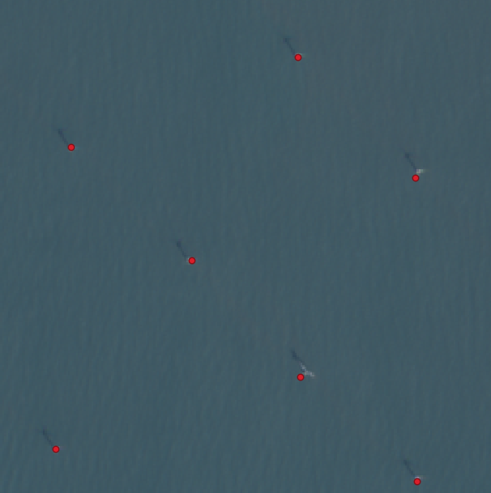

Example: Windows from GeoJSON
-----------------------------

In this example, we will create windows that contain point features in a GeoJSON file.
We will then acquire Sentinel-2 images in those windows, and train a model to predict
the points, using a bounding box object detection head.

We used this GeoJSON of marine infrastructure while creating this example, but you
should be able to substitute any GeoJSON (although model performance will vary):

https://pub-956f3eb0f5974f37b9228e0a62f449bf.r2.dev/outputs/marine/latest.geojson

### Add Windows

We will start by creating a new dataset: create a directory `/path/to/dataset` and
create the dataset configuration file at `/path/to/dataset/config.json` as follows:

```json
{
    "layers": {
        "sentinel2": {
            "type": "raster",
            "band_sets": [{
                "dtype": "uint8",
                "bands": ["R", "G", "B"]
            }],
            "data_source": {
                "class_path": "rslearn.data_sources.gcp_public_data.Sentinel2",
                "init_args": {
                  "index_cache_dir": "cache/sentinel2/",
                  "sort_by": "cloud_cover",
                  "use_rtree_index": false
                }
            }
        }
    }
}
```

Download the GeoJSON data to a subfolder within the dataset directory:

```
export DATASET_PATH=/path/to/dataset
mkdir -p $DATASET_PATH/source_data/all/
mkdir -p $DATASET_PATH/source_data/subset/
wget https://pub-956f3eb0f5974f37b9228e0a62f449bf.r2.dev/outputs/marine/latest.geojson -O $DATASET_PATH/source_data/all/latest.geojson
```

We sampled 100 features to use, but you can try using the full GeoJSON if you like.

```python
import json
import os
import random
ds_path = os.environ["DATASET_PATH"]
with open(os.path.join(ds_path, "source_data/all/latest.geojson")) as f:
    feature_collection = json.load(f)
feature_collection["features"] = random.sample(feature_collection["features"], 100)
with open(os.path.join(ds_path, "source_data/subset/latest.geojson"), "w") as f:
    json.dump(feature_collection, f)
```

Now we can use the `dataset add_windows` command to create the windows.

```
rslearn dataset add_windows --group default --fname $DATASET_PATH/source_data/subset/latest.geojson --grid_size 256 --utm --resolution 10 --start 2024-01-01T00:00:00+00:00 --end 2024-07-01T00:00:00+00:00 --root $DATASET_PATH
```

Here, we create windows along a 256x256 grid by passing `--grid_size 256`; windows are
created at each grid cell that intersects at least one GeoJSON feature. We could
instead pass `--window_size 256` to create 256x256 windows centered at each GeoJSON
feature, but since we will be using the features as labels (and we won't use random
cropping in this example) that would allow the model to learn that there is always a
label at the center of each image.

We use `--utm` to create the windows in UTM projection, and `--resolution 10` to make
the windows 10 m/pixel so they match the Sentinel-2 resolution.

Use rslearn to retrieve the Sentinel-2 images:

```
rslearn dataset prepare --root $DATASET_PATH --workers 32
rslearn dataset ingest --root $DATASET_PATH --workers 8 --no-use-initial-job --jobs-per-process 1
rslearn dataset materialize --root $DATASET_PATH --workers 8 --no-use-initial-job
```

### Add Labels

We now use the
[LocalFiles data source](../DatasetConfig.md#rslearndata_sourceslocal_fileslocalfiles)
to incorporate the points as an additional vector layer in our dataset.

Add a new layer to the dataset configuration file:

```json
{
    "layers": {
        "sentinel2": { ... },
        "label": {
            "type": "vector",
            "format": {
                "name": "geojson",
                "coordinate_mode": "crs"
            },
            "data_source": {
                "class_path": "rslearn.data_sources.local_files.LocalFiles",
                "init_args": {
                  "src_dir": "source_data/all/"
                }
            }
        }
    }
}
```

Here, we reference the entire dataset rather than the subset because there may be
points that we didn't sample that still intersect with the windows we created.

Note: if your GeoJSON is not inside the dataset path, then use an absolute path
prefixed with "file://" for the `src_dir`. The `src_dir` must be the directory
containing the GeoJSON, and it should not contain other files.

Run prepare, ingest, and materialize again to get the labels:

```
rslearn dataset prepare --root $DATASET_PATH --disabled-layers sentinel2 --workers 32
rslearn dataset ingest --root $DATASET_PATH --disabled-layers sentinel2 --workers 8 --no-use-initial-job --jobs-per-process 1
rslearn dataset materialize --root $DATASET_PATH --disabled-layers sentinel2 --workers 8 --no-use-initial-job
```

You should be able to view the resulting cropped GeoJSON labels alongside the
Sentinel-2 images using qgis.



### Train Model

Now we can create a model configuration for fine-tuning SatlasPretrain to predict
marine infrastructure. Although our labels are points, we treat it as a bounding box
object detection task, since that task is more common and we can then use standard
approaches like Faster-RCNN.

Before the model configuration file, we reuse the script from the main README to assign
a train or val split for each window based on a hash of the window name:

```python
import hashlib
import os
import tqdm
from rslearn.dataset import Dataset, Window
from upath import UPath

ds_path = UPath(os.environ["DATASET_PATH"])
dataset = Dataset(ds_path)
windows = dataset.load_windows(show_progress=True, workers=32)
for window in tqdm.tqdm(windows):
    if hashlib.sha256(window.name.encode()).hexdigest()[0] in ["0", "1"]:
        split = "val"
    else:
        split = "train"
    if "split" in window.options and window.options["split"] == split:
        continue
    window.options["split"] = split
    window.save()
```

Here is the full model configuration file, the comments walk through what each part is
doing.

```yaml
model:
  class_path: rslearn.train.lightning_module.RslearnLightningModule
  init_args:
    # This section defines the model architecture. We reuse the encoder from the
    # README, essentially applying SatlasPretrain, so check the README for more details
    # about that.
    model:
      class_path: rslearn.models.singletask.SingleTaskModel
      init_args:
        encoder:
          - class_path: rslearn.models.satlaspretrain.SatlasPretrain
            init_args:
              model_identifier: "Sentinel2_SwinB_SI_RGB"
              # We enable the Feature Pyramid Network in SatlasPretrain since it is
              # better suited for making object detection predictions.
              fpn: true
        decoder:
          # Here, we specify the decoder to make object detection predictions. We use
          # Faster R-CNN for this.
          - class_path: rslearn.models.pick_features.PickFeatures
            init_args:
              # With FPN enabled, SatlasPretrain outputs five feature maps, with the
              # first one upsampled to the input resolution.
              # For detection tasks, it is best to skip the upsampled one, so we just
              # use the other four.
              indexes: [1, 2, 3, 4]
          - class_path: rslearn.models.faster_rcnn.FasterRCNN
            init_args:
              # The encoder outputs a list of feature maps at different resolutions.
              # The downsample_factors specifies those resolutions relative to the
              # input resolution, i.e., the feature maps are at 1/4, 1/8, 1/16, and
              # 1/32 of the original input resolution.
              downsample_factors: [4, 8, 16, 32]
              # Although the Swin-Base backbone in SatlasPretrain outputs different
              # embedding depths for each feature map, we have enabled the FPN which
              # produces 128 features for each resolution.
              num_channels: 128
              # Our task has two classes, but there is a quirk in the setup here where
              # we need to reserve class 0 for background.
              num_classes: 3
              anchor_sizes: [[32], [64], [128], [256]]
    # We have tested this learning rate and it seems to work reasonably well for this
    # task.
    # In practice for a new task you may need to try a few different learning rates.
    lr: 0.00002
data:
  class_path: rslearn.train.data_module.RslearnDataModule
  init_args:
    path: ${DATASET_PATH}
    # The inputs section defines what data to load from the rslearn dataset. The keys
    # are arbitrary names to give to the data that will be referenced either later in
    # the configuration file, or correspond to what some models or tasks expect.
    inputs:
      # We load the Sentinel-2 image here. The "image" key matches what SatlasPretrain
      # expects its input image to be called.
      image:
        data_type: "raster"
        # This name corresponds to the layer name in our dataset configuration file.
        layers: ["sentinel2"]
        # We load the R, G, and B bands in that order because that is what the RGB
        # version of SatlasPretrain which we are using expects.
        bands: ["R", "G", "B"]
        # This tells rslearn to load the image as a FLOAT32.
        dtype: FLOAT32
        # This passthrough option is currently needed for all inputs to the model.
        passthrough: true
      # We load the marine infrastructure points here. "targets" corresponds to what
      # DetectionTask wants the points to be called.
      targets:
        data_type: "vector"
        # Again, this corresponds to the layer name in the dataset config.
        layers: ["label"]
        # This tells rslearn that this input is a target. This way, when applying the
        # model to detect marine infrastructure in new unlabeled windows, rslearn won't
        # try to load the label data.
        is_target: true
    task:
      class_path: rslearn.train.tasks.detection.DetectionTask
      init_args:
        # This specifies the name of the GeoJSON property on each feature that should
        # be used to get the category.
        property_name: "category"
        # This is a list of expected categories. The first class is included for
        # compatibility with the Faster R-CNN predictor, which expects class 0 to be
        # reserved.
        classes: ["background", "offshore_platform", "offshore_wind_turbine"]
        # By default, if box_size is not set, DetectionTask will use the bounds of each
        # GeoJSON feature as the bounding box labels. However, we have points, so we
        # would end up with boxes with zero area. This option makes it instead compute
        # the boxes by adding this padding to the centroid of each GeoJSON feature.
        box_size: 15
        # This is for visualization: when creating visualization images using
        # `model test`, we output RGB image by multiplying the input (which will be
        # normalized to 0-1) by 255.
        remap_values: [[0, 1], [0, 255]]
        # We will use random cropping when training our model. This option says that if
        # the center of a box is outside the random crop, then that box won't be used.
        # By default, the box will be used if it overlaps the random crop at all.
        exclude_by_center: true
        # We enable mAP, F1, and precision/recall.
        enable_map_metric: true
        enable_f1_metric: true
        enable_precision_recall: true
        # For F1, it will report the F1 score at each of the thresholds here. If a
        # sub-list specifies multiple thresholds, then the best over those thresholds
        # is reported for that sub-list.
        f1_metric_thresholds: [[0.05, 0.1, 0.2, 0.3, 0.4, 0.5, 0.6, 0.7, 0.8, 0.9, 0.95], [0.1], [0.2], [0.3], [0.4], [0.5], [0.6], [0.7], [0.8], [0.9]]
    batch_size: 8
    num_workers: 16
    # The remaining options specify different things to do for different stages like
    # training vs validation vs prediction.
    default_config:
      # These options are repeated for each stage.
      groups: ["default"]
      transforms:
        # This is the standard Satlas normalization to divide 0-255 images by 255.
        - class_path: rslearn.train.transforms.normalize.Normalize
          init_args:
            mean: 0
            std: 255
            valid_range: [0, 1]
    train_config:
      # patch_size here tells rslearn to train on random crops of this width and
      # height.
      patch_size: 256
      # We override transforms here so we can include a random flipping augmentation,
      # just used for training.
      transforms:
        - class_path: rslearn.train.transforms.normalize.Normalize
          init_args:
            mean: 0
            std: 255
            valid_range: [0, 1]
        - class_path: rslearn.train.transforms.flip.Flip
          init_args:
            image_selectors: ["image"]
            box_selectors: ["target/"]
      tags:
        split: train
    val_config:
      patch_size: 256
      # Instead of random cropping, we load all crops for validation and testing.
      load_all_crops: true
      tags:
        split: val
    test_config:
      patch_size: 256
      load_all_crops: true
      tags:
        split: val
trainer:
  max_epochs: 100
  callbacks:
    - class_path: lightning.pytorch.callbacks.LearningRateMonitor
      init_args:
        logging_interval: "epoch"
    # We freeze the SatlasPretrain backbone for one epoch before unfreezing.
    - class_path: rslearn.train.callbacks.freeze_unfreeze.FreezeUnfreeze
      init_args:
        module_selector: ["model", "encoder", 0, "model"]
        unfreeze_at_epoch: 1
    # Save the best checkpoint based on mAP on validation set.
    - class_path: rslearn.train.callbacks.checkpointing.ManagedBestLastCheckpoint
      init_args:
        monitor: val_mAP
        mode: max
# Here we enable automatic checkpoint management and logging to W&B.
# Set WANDB_MODE=offline to disable online logging.
project_name: marine_infrastructure
run_name: satlaspretrain_finetune
management_dir: ${MANAGEMENT_DIR}
```

After saving this as `model.yaml`, we can now start the fine-tuning:

```
export MANAGEMENT_DIR=./project_data
rslearn model fit --config model.yaml
```

### Evaluate and Visualize Outputs

We can evaluate the model on the validation set, and visualize its outputs as well.

```
mkdir ./vis/
rslearn model test --config model.yaml --model.init_args.visualize_dir=./vis
```

It should print out the metrics. The F1_0.05 should correspond to the best F1 over many
different score thresholds, while the others are useful for seeing the precision and
recall at each score threshold to decide which to use for prediction.

You can also look at the images saved in the `vis` folder.

Note that we have only trained on around 90 examples, so the accuracy will not be that
good, this is just intended to be an example.
